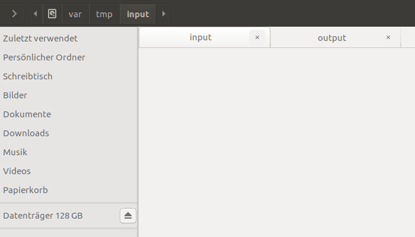

# filesync-replikativ 

A filesystem synchronization tool similar to Dropbox over replikativ. It works
similar to git due to [CDVCS](http://replikativ.io/doc/cdvcs.html). To resolve
conflicts you need to drop to the REPL still. You also cannot transfer files
larger than 50 MiB at the moment, but this is not hard to fix. 

## Usage

You can set the `:sync-path` to the folder you would like to sync and the
`:store-path` to a folder where replikativ will store the history of changes to
the folder. The `:remotes` are servers which you want to share the data with.
These can also be brokers to connect your machines. Finally pick a different
cdvcs-id (best is random) for each folder, or you will get horrible unintended
conflicts!

~~~clojure
{:store-path "/tmp/sync-test"
 :sync-path "/var/tmp/input"
 :remotes ["ws://localhost:31744"]
 :user "mail:whilo@topiq.es"
 :cdvcs-id #uuid "34db9ec4-82bf-4c61-8e2a-a86294f0e6d4"
 :blob-backend :inline #_:ipfs-block}
~~~

~~~shell
lein run resources/example-config.edn
~~~

## Content Addressable backends

Filesync can leverage [IPFS](https://ipfs.io)' fast content delivery mechanisms
and demonstrates how to integrate a content addressable store with it. A
critical requirement is that the content is immutable. If it is addressable
through a merkle semantics then it composes well with replikativ and the whole
system guarantees merkle integrity.

### benefits
- fast and efficient p2p binary delivery
- access to your files also from IPFS
- automatic deduplication through IPFS' replication semantics (link?)

### drawbacks
- you depend on IPFS for availability, while the `:inline` replication ensures
  that all your data is available locally
  

This works by storing the content in the external content addressable store:

~~~clojure
(ipfs/block-put {:request {:multipart [{:name (pr-str (:path p))
                                        :content (FileInputStream. (io/file (:path p)))
                                        :content-type "application/octet-stream"}]}})
~~~

And then storing this reference. There is nothing magical to it. Other possible
backends would
be [eMule](http://www.emule-project.net/home/perl/general.cgi?l=2),
[bittorrent](http://bittorrent.org/)
or [dat](https://github.com/datproject/dat). Feel free to open pull-requests.

## TODO

- allow OR-Map for different semantics
- fix protocol to handle files in fixed size binary blocks

## License

Copyright © 2016-2017 Christian Weilbach

Distributed under the Eclipse Public License either version 1.0 or (at
your option) any later version.
